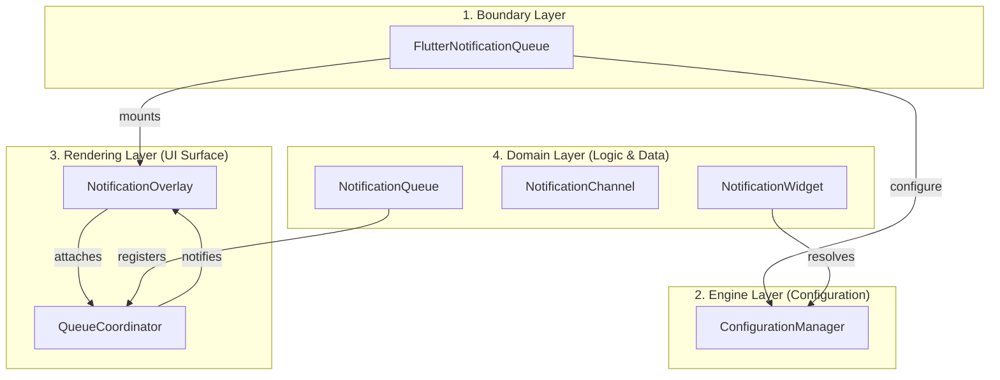

# FNQ — Core Engine Architecture

Flutter Notification Queue (FNQ) is a notification overlay system built on a strictly hierarchical 4-layer architecture. Each layer has a singular responsibility and a well-defined boundary.

## 🏗️ The 4-Layer Hierarchy

---

## 🏛️ Subsystem Definitions

### 1. FlutterNotificationQueue (Boundary)
The only public entry point for initialization and integration.
- **Entry Points**: `initialize()` for setup, `builder()` for `MaterialApp`.
- **Primary Goal**: Shield internal complexity from the user.

### 2. ConfigurationManager (Engine)
The stateless configuration registry and lookup service.
- **Role**: Stores all `NotificationQueue` and `NotificationChannel` instances.
- **Lifecycle**: Must be configured once via `initialize()`. Access before initialization throws `StateError`.
- **Transparency**: Entirely internal. Not exposed to the public API.

### 3. NotificationOverlay (Rendering)
The Flutter widget that hosts the notification stack.
- **Role**: Manages the `OverlayPortalController` and provides the rendering surface.
- **Dual Strategy**: Automatically falls back to a `Stack` if no `Overlay` is found (e.g., in `MaterialApp.builder`).

### 4. QueueCoordinator (Bridge)
The rendezvous point between logic and UI.
- **Role**: Bridges `NotificationQueue` (domain logic) to `NotificationOverlay` (rendering).
- **Function**: Maintains the registry of **active** queues (those with visible notifications) and triggers overlay updates.

---

## 📐 Design Principles

1.  **Strict Layering**: No layer may skip its immediate neighbor. (e.g., `NotificationWidget` resolves its configuration through the `ConfigurationManager`, never directly from `initialize` params).
2.  **Widgets Render, Singletons Coordinate**: Widgets never hold global state. Singletons never render.
3.  **Self-Organization**: Queues manage their own lifecycle. They register with the `Coordinator` when a notification arrives and deregister when empty.
4.  **Resilient Defaults**: The system is fully functional with zero configuration.
