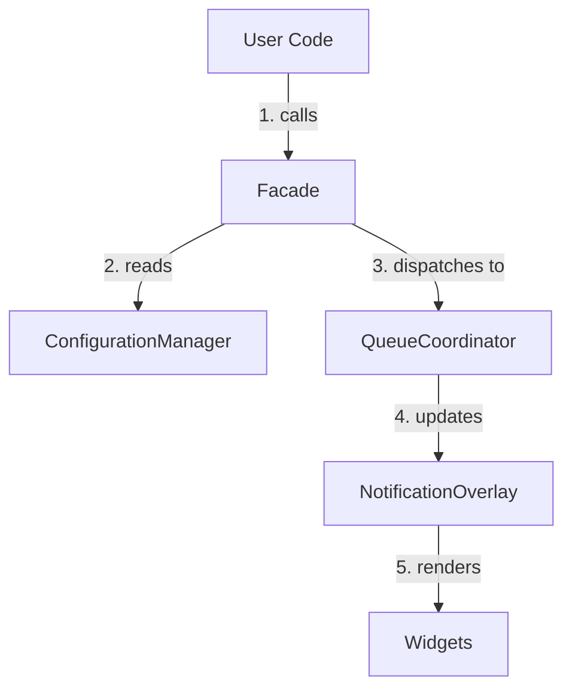

# Core Architecture

FNQ follows a strict unidirectional data flow and layered architecture.

## The 4 Layers

1.  **Boundary (API)**: `FlutterNotificationQueue`
    - The public entry point for the library.
2.  **Engine (Config)**: `ConfigurationManager`
    - Stores the system configuration (queues, channels).
3.  **Bridge (State)**: `QueueCoordinator`
    - The dynamic runtime state that directs traffic.
4.  **Rendering (UI)**: `NotificationOverlay`
    - The actual widgets rendered on the screen.

## Data Flow

## Design Decisions

- **Stateless Queues**: Queue definitions (`TopRightQueue`) are immutable const objects. They do not hold state. The `QueueCoordinator` holds the state.
- **Zero Global State in Widgets**: `NotificationWidget` and `QueueWidget` are pure UI. They receive all data via injection or providers, facilitating easier testing.
- **Lazy Initialization**: Components are created only when needed.
