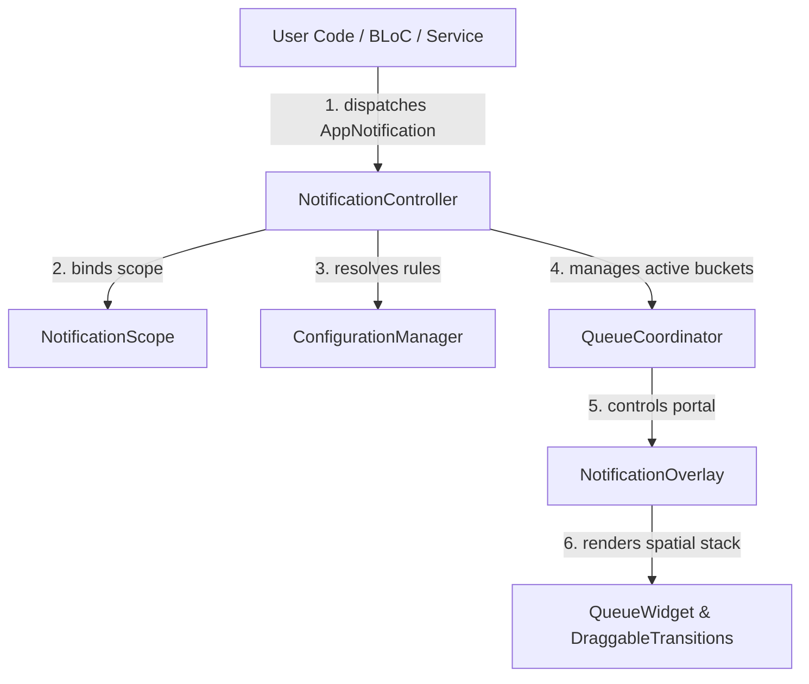

# Core Architecture (v0.4.x)

FNQ follows a unidirectional data flow and modular, multi-tenant architecture.

## The 4 Subsystems

1. **Control & Scope (`NotificationController` & `NotificationScope`)**
   - Pure Dart state owner and widget tree overlay injector.
   - Manages notification dispatching, capacity limits, lifecycle events, and history logging.

2. **Configuration Registry (`ConfigurationManager`)**
   - Validates and stores immutable spatial `NotificationQueue` and `NotificationChannel` definitions.

3. **Queue Coordination (`QueueCoordinator`)**
   - Dynamic runtime state manager that routes `AppNotification` payloads into active queue buckets.
   - Manages `OverlayPortalController` attachment and detachment.

4. **Overlay Surface (`NotificationOverlay` & `QueueWidget`)**
   - The UI layer rendered inside the Flutter overlay portal. Renders queue stacks and handles spatial physics and gesture transitions.

## Data Flow

```mermaid
graph TD
    User[User Code / BLoC / Service] -->|1. dispatches AppNotification| Controller[NotificationController]
    Controller -->|2. binds scope| Scope[NotificationScope]
    Controller -->|3. resolves rules| Config[ConfigurationManager]
    Controller -->|4. manages active buckets| Coord[QueueCoordinator]
    Coord -->|5. controls portal| Overlay[NotificationOverlay]
    Overlay -->|6. renders spatial stack| UI[QueueWidget & DraggableTransitions]
```

## Architectural Principles

- **Decoupled Data Intent**: `AppNotification` payloads are pure data objects decoupled from rendering widgets.
- **Multi-Tenant Subtree Isolation**: Multiple `NotificationController` instances can coexist cleanly in isolated subtrees.
- **Zero Global Singletons**: Avoids global static state, enabling isolated parallel testing and multi-window Flutter support.
- **Stateless Queues**: Queue definitions (`NotificationQueue`) are immutable value objects. State is held in the coordinator and queue widget states.
