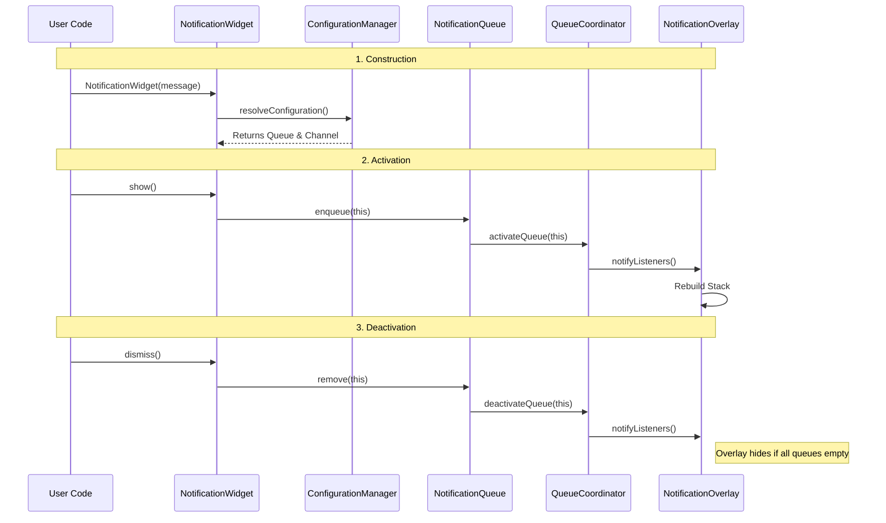

# FNQ — Lifecycle & Coordination

This document details the internal flow of information and the coordination between domain logic and the rendering surface.

## 🔄 The Notification Lifecycle

---

## 🤝 The Coordination Bridge (`QueueCoordinator`)

The `QueueCoordinator` is the most critical internal singleton. It solves a classic architectural problem: **How do domain objects (which know nothing of widgets) trigger a UI rebuild?**

1.  **Registry**: It acts as a registry of "Active" queues.
2.  **ValueListenable**: It exposes its registry as a `ValueListenable`.
3.  **Subscriber**: The `NotificationOverlay` (a widget) listens to this registry.

This separation ensures that `NotificationQueue` remains a pure logic/data structure with no dependency on `BuildContext` or the Widget tree.

---

## 🎢 Feedback & Self-Regulation

### Queue Pressure (Balancing Loop)
Each `NotificationQueue` maintains two internal collections:
-   **Active Stock**: What is currently being rendered (up to `maxStackSize`).
-   **Pending Stock**: Notifications waiting for a slot.

When an active notification is dismissed, the queue automatically promotes the next pending item. This creates a goal-seeking loop that ensures the screen is never overwhelmed while ensuring all notifications eventual visibility.

### Empty State Hiding
The `QueueCoordinator` monitors the aggregate activity count. When the count drops to zero, it signals the `OverlayPortalController` to `hide()`, ensuring zero rendering overhead when the system is idle.
