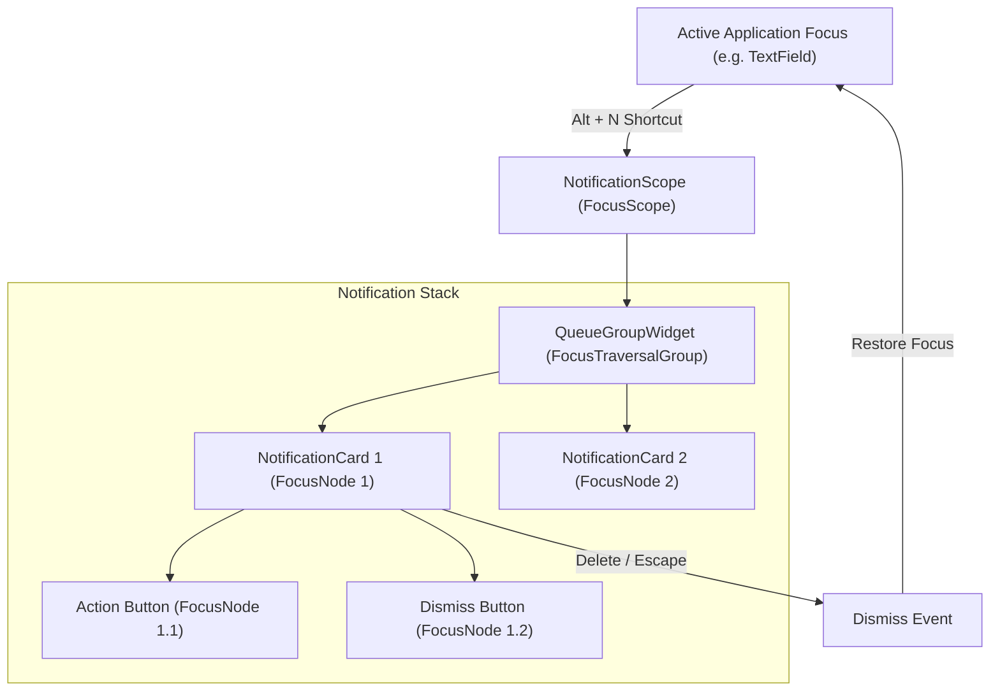

# Accessibility (A11y) & Keyboard Focus Traversal Specification

> **Status**: Planned Specification (`v0.5.0` Roadmap Target)  
> **Author**: FNQ Core Architecture Team  
> **Category**: Phase 3 — Accessibility, Keyboard Traversal & Enterprise Compliance

---

## 1. Contextual UX Philosophy & Non-Intrusive Principles

Notification overlays float dynamically above an application's primary widget tree (`MaterialApp.builder` or `OverlayPortal`). Because of this decoupled visual layer, traditional accessibility patterns must be carefully calibrated to avoid disrupting user workflows.

### Principle 1: Non-Intrusive Focus Ingestion
- **Constraint**: Notifications **MUST NEVER** automatically steal keyboard focus from the active application upon appearance.
- **Rationale**: Stealing focus interrupts user text input in forms, search bars, text editors, and terminal views.
- **Implementation**: The `NotificationOverlay` remains unfocused by default. A global focus shortcut (`Alt + N` / `Option + N`) allows users to intentionally transfer focus into the notification stack on demand.

### Principle 2: Polite vs. Assertive Live Region Announcements
- **Constraint**: Screen readers (VoiceOver, TalkBack, NVDA, JAWS) must speak new notifications without cancelling active screen reader speech unless the notification is marked `NotificationPriority.critical`.
- **Implementation**:
  - `NotificationPriority.low`, `normal`, `high` $\rightarrow$ `SemanticsService.announce(..., Assertiveness.polite)`
  - `NotificationPriority.critical` $\rightarrow$ `SemanticsService.announce(..., Assertiveness.assertive)`

### Principle 3: Reversible Focus Handoff
- **Constraint**: Exiting or dismissing all notifications via keyboard MUST return focus to the exact widget element that held focus prior to entering the notification stack.

---

## 2. Configuration Model: `NotificationA11yOptions`

The accessibility system is configured at controller level via `NotificationA11yOptions`:

```dart
import 'package:flutter/foundation.dart';
import 'package:flutter/services.dart';
import 'package:meta/meta.dart';

/// Configuration options for accessibility, live regions, and keyboard focus.
@immutable
class NotificationA11yOptions {
  const NotificationA11yOptions({
    this.enableLiveRegions = true,
    this.announcePriorityThreshold = NotificationPriority.normal,
    this.focusShortcut = const SingleActivator(LogicalKeyboardKey.keyN, alt: true),
    this.enableKeyboardDismiss = true,
    this.dismissKey = LogicalKeyboardKey.delete,
    this.escapeDismissesFocused = true,
    this.restoreFocusOnExit = true,
  });

  /// Whether screen reader live announcements are enabled on notification arrival.
  final bool enableLiveRegions;

  /// Minimum priority level required to trigger screen reader live announcements.
  final NotificationPriority announcePriorityThreshold;

  /// Keyboard shortcut to transfer focus from the app to the active notification stack.
  ///
  /// Defaults to [Alt + N] (Option + N on macOS). Set to `null` to disable shortcut navigation.
  final ShortcutActivator? focusShortcut;

  /// Whether pressing [dismissKey] or Escape dismisses the focused notification card.
  final bool enableKeyboardDismiss;

  /// Keyboard key that triggers dismissal when a notification is focused.
  ///
  /// Defaults to [LogicalKeyboardKey.delete].
  final LogicalKeyboardKey dismissKey;

  /// Whether pressing Escape dismisses the currently focused notification.
  final bool escapeDismissesFocused;

  /// Whether focus returns to the previously focused app element after dismissing
  /// or exiting the notification stack.
  final bool restoreFocusOnExit;
}
```

---

## 3. Architecture & Data Flow



---

## 4. Component-Level Semantics Tree Specification

### 4.1. `NotificationWidget` Semantics Blueprint

Each active notification card emits a structured semantic subtree:

```dart
Semantics(
  container: true,
  focused: _isFocused,
  label: 'Notification: ${widget.title ?? ""}, ${widget.message}',
  hint: 'Press Delete or Escape to dismiss. Press Tab to reach action buttons.',
  customSemanticsActions: {
    CustomSemanticsAction(label: 'Dismiss'): () => dismiss(),
    if (widget.action != null)
      CustomSemanticsAction(label: widget.action!.label): () => widget.action!.onTap(),
  },
  child: Focus(
    focusNode: _focusNode,
    onKeyEvent: _handleKeyEvent,
    child: CardWidget(...),
  ),
)
```

### 4.2. Group Stack Pill Semantics Blueprint

When notifications are collapsed in a group:

```dart
Semantics(
  button: true,
  label: 'Grouped notifications: $count items for channel ${groupKey}',
  hint: 'Double tap or press Enter to expand or collapse group stack',
  onTap: () => toggleExpand(),
  child: StackPillWidget(...),
)
```

---

## 5. Keyboard Navigation Keybindings

When focus is transferred into the notification stack (`Alt + N`):

| Shortcut Key | Scope | Action |
| :--- | :--- | :--- |
| `Alt + N` / `Option + N` | Global | Transfer focus from app to top-most active notification card. |
| `Tab` | Notification Stack | Cycle focus to next focusable element (Card $\rightarrow$ Action Button $\rightarrow$ Dismiss Button $\rightarrow$ Next Card). |
| `Shift + Tab` | Notification Stack | Cycle focus to previous focusable element. |
| `ArrowDown` / `ArrowRight` | Queue Stack | Shift focus to next card in the current queue stack. |
| `ArrowUp` / `ArrowLeft` | Queue Stack | Shift focus to previous card in the current queue stack. |
| `Delete` / `Backspace` | Focused Card | Programmatically dismiss the currently focused notification. |
| `Escape` | Focused Card | Dismiss currently focused notification and return focus to application. |
| `Space` / `Enter` | Focused Control | Trigger action button callback or toggle group stack expansion. |

---

## 6. Verification & Automated Testing Plan

### 6.1. Semantics Tree Verification
Use `tester.getSemantics` in widget tests to assert semantic labels:
```dart
testWidgets('NotificationWidget emits correct semantic label', (tester) async {
  // 1. Pump NotificationScope + Controller
  // 2. Dispatch AppNotification(title: 'Order', message: 'Shipped')
  // 3. Verify SemanticsFinder:
  expect(
    tester.getSemantics(find.byType(NotificationWidget)),
    matchesSemantics(
      label: 'Notification: Order, Shipped',
      isFocusable: true,
    ),
  );
});
```

### 6.2. Focus Traversal Verification
Use `tester.sendKeyEvent` to simulate keyboard navigation:
```dart
testWidgets('Alt+N transfers focus to notification and Delete dismisses it', (tester) async {
  // 1. Pump TextField and NotificationScope
  // 2. Send Alt+N shortcut
  // 3. Assert notification is focused
  // 4. Send Delete key
  // 5. Assert notification is dismissed and focus returns to TextField
});
```

---

## 7. Implementation Checklist (`v0.5.0`)

- [ ] **Phase 1**: Add `NotificationA11yOptions` to `NotificationController` and `ConfigurationManager`.
- [ ] **Phase 2**: Add `SemanticsService.announce` live region triggers on `NotificationQueued` events.
- [ ] **Phase 3**: Wrap `NotificationWidget` and `QueueGroupWidget` in structured `Semantics` and `FocusNode` widgets.
- [ ] **Phase 4**: Implement `Alt + N` focus handoff shortcut and `FocusTraversalGroup` management.
- [ ] **Phase 5**: Add automated unit & widget accessibility test suite in `test/src/a11y/`.
